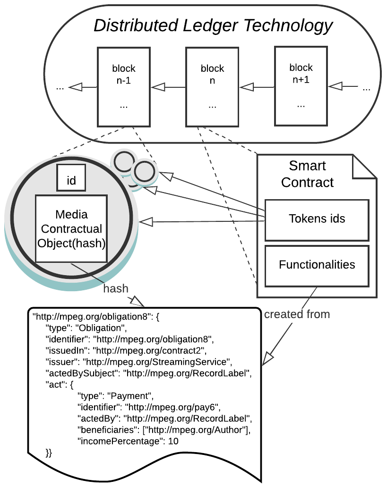
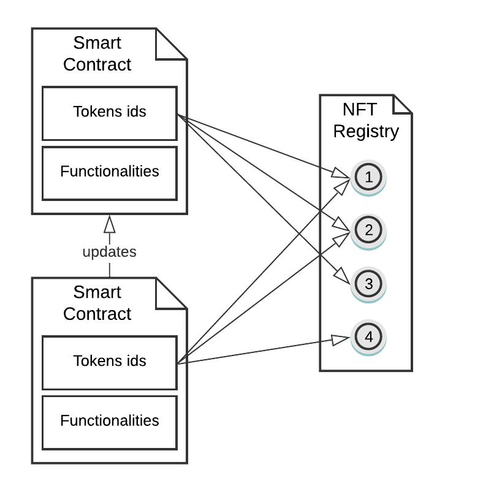

# MPEG-21-Part-23 Smart Contract for Media (DLT-Manager)
Panos Kudumakis, Mirko Zichichi, Víctor Rodríguez-Doncel, Marina Ljubojevic, Mohamed Allouche, Alexandre Moreaux and Mihai Mitra

## Abstract
In the last few years, MPEG has developed a set of standardized RDF ontologies and XML schemas for codifying intellectual property (IP) rights information related to music and media. ISO/IEC 21000-19 Media Value Chain Ontology (MVCO) facilitates rights tracking for fair, timely, and transparent payment of royalties by capturing user roles and their permissible actions on a particular IP entity. ISO/IEC 21000-19/AMD1 Audio Value Chain Ontology (AVCO) extends MVCO functionality related to describing IP entities in the audio domain, e.g., multitrack audio and time segments. ISO/IEC 21000-21 (2nd Ed) Media Contract Ontology (MCO) facilitates the conversion of narrative contracts to digital ones related to exploiting IP rights, payments, and notifications. For the latter, XML schemas have been developed as ISO/IEC 21000-20 (2nd Ed) Contract Expression Language (CEL). 
Furthermore, the axioms in these XML schemas and RDF ontologies can drive the execution of rights-related workflows in controlled environments, e.g., Distributed Ledger Technologies (DLTs), where transparency and interoperability are favored for fair trade of music and media. Thus, the aim of **ISO/IEC 21000-23 Smart Contracts for Media** is to provide the means (e.g., APIs) for converting these XML and RDF media contracts to smart contracts that can be executed on existing DLT environments. 
By doing this conversion in a standard way for several smart contract languages, MPEG-21 CEL/MCO schemas and ontologies will prevail as the interlingua for transferring verified contractual data from one DLT to another. 
Another essential feature of this standard is that it allows binding the clauses of a smart contract with those of a narrative contract and vice versa. In this way, each party signing a smart contract precisely knows what the clauses stored in the smart contract express.

## Ontology objects relations with DLTs
In order to bring what the MPEG-21 framework can express in a DLT, some relationships between MPEG-21 elements and DLT components can be mapped out. The following mapping is used in converting MPEG-21 CEL/MCO contracts to smart contracts for media and vice versa. 

1. Contract - Smart contract for media: the MPEG-21 CEL/MCO contract element is the one that includes or refers to the digitalized contractual information extracted from a narrative contract. In comparison, the smart contract for media is the result of the conversion process from the MPEG-21 CEL/MCO contract. Thus, the counterpart of an instance of a MPEG-21 CEL/MCO contract is a unique smart contract for media deployed in a specific DLT. 
2. Party (user) - DLT address: a party element is the representation of the identity of a user or organization bound by the narrative contract. Since identities in DLTs are represented through addresses, the party element counterpart is a DLT address. Thus, a party identity represented by a DLT address may also be authenticated in the DLT and referenced in a smart contract for media.  
3. IP entity - Non-fungible token: an IP entity element represents an asset, and the reference to this asset can be stored in a DLT. This representation of an asset may be serialized according to the concept of non-fungible tokens. Thus, in smart contracts, an IP entity may be represented by a token. Then, the entire set of information related to a specific IP entity is linkable to the associated token.
4. Deontic expression (action, fact) - Non-fungible token: a deontic expression encompasses the properties of an agreed machine-readable contract clause regulating the parties' actions, e.g., obligations, permissions, and prohibitions. This clause representation may also be serialized following the non-fungible tokens associated with the smart contracts for media.

## Smart Contract for Media and Non Fungible Tokens
The Smart Contracts for Media can take advantage of Non Fungible Tokens to store Media Contractual Objects. In particular, each Smart Contract for Media generated by a MPEG-21 Contract can reference tokens already present in the DLT that refer to a specific Media Contractual Object instance. 

 

We can devise two constituent parts of a Smart Contracts for Media:
- the immutable information that is included in the smart contract that refers to data stored on-chain (e.g., tokens ids) or off-chain (e.g., a hash of a datum);
- the immutable set of instructions that implements the logic of the contract, i.e., the functionalities.

In order to be immutable, data do not necessarily have to be stored directly on-chain. Indeed, this practice is costly in terms of time, space, and economic in most DLTs. Off-chain data storage, accompanied by on-chain storage of the result of the cryptographic hash function, is a tradeoff that allows for information immutability and more cost-effective processing. 
 
Thus, a Media Contractual Object, e.g., a payment obligation, can be stored off-chain, and then its hash stored within a Non Fungible Token. Some functionalities can be created from the same Object, too, e.g., income shares and a Smart Contract for Media will include these together with the on-chain reference to the token. 
Interoperability of data on-chain can be obtained using simple data links, i.e., smart contracts that reference other smart contracts’ addresses and tokens’ ids. For instance, an IP Entity can be represented by a single Non Fungible Token with an id equal to N issued in a contract with an address equal to X. Then, a Smart Contract for Media with address Y that includes that specific IP Entity in its clauses only needs to reference the address X and the id N. Another Smart Contract for Media with address Z that updates the previous one only needs to refer to the same token N in X without having to create a new one.



## Implementation
The normative Smart Contract for Media is DLT agnostic. Implementations of media contractual objects API and the required Python and JavaScript reference software modules (e.g., parsers and generators) with detailed conformance testing instructions are provided for the bidirectional conversion of MPEG-21 CEL/MCO contracts to smart contracts for media. These software modules have been validated and demonstrated with pre-defined MPEG-21 CEL/MCO encoded contracts and implemented using the following DLTs:
- MPEG-21 CEL contracts to Solidity/Ethereum and Michelson/Tezos smart contracts; and, 
- MPEG-21 MCO contracts to Solidity/Ethereum and TEAL/Algorand smart contracts.

## TEAL/Algorand
Algorand Smart Contracts (ASC1) are tiny programs that, once deployed, are remotely callable from any node in the Algorand blockchain. These contracts typically handle the primary decentralized logic of a decentralized application and can modify data associated with the contract on a global basis or a per-user basis. 
The smart contracts in Algorand are written in TEAL, Transaction Execution Approval Language. TEAL is a bytecode-based stack language that executes inside Algorand transactions. PyTeal is a python language binding for Algorand smart contracts that abstracts away the complexities of writing smart contracts in TEAL.
In the following, we present the implementation of the main smart contract and the Non Fungible Token contract for working with the Smart Contract for Media. The full source code can be found in this repository in ```/smart-contract-templates/algo/```.

```python
from pyteal import *


def approval_program():
    creator = Bytes("creator")
    contentUri = Bytes("contentUri")
    contentHash = Bytes("contentHash")
    totNFT = Bytes("totNFT")
    concatenatedNFTsID = Bytes("concatenatedNFTsID")

    on_deployment = Seq([
        Assert(Txn.application_args.length() == Int(4)),
        App.globalPut(creator, Txn.sender()),
        App.globalPut(contentUri, Txn.application_args[0]),
        App.globalPut(contentHash, Txn.application_args[1]),
        App.globalPut(totNFT, Txn.application_args[2]),
        App.globalPut(concatenatedNFTsID, Txn.application_args[3]),
        Return(Int(1))
    ])

    set_income_benef_num = Seq([
        Assert(Txn.application_args.length() == Int(2)),
        Assert(Txn.accounts.length() == Int(1)),
        App.localPut(
            Int(1),
            Bytes('beneficiaries_num'),
            Btoi(Txn.application_args[1])
        ),
        Return(Int(1))
    ])

    set_income_benef = Seq([
        Assert(Txn.application_args.length() == Int(4)),
        App.localPut(
            Int(1),
            Txn.application_args[1],
            Txn.application_args[2]
        ),
        App.localPut(
            Int(1),
            Txn.application_args[2],
            Btoi(Txn.application_args[3])
        ),
        Return(Int(1))
    ])

    # Checks whether the sender is creator.
    is_creator = Txn.sender() == App.globalGet(creator)

    # Verfies that the application_id is 0, jumps to on_deployment.
    # Verifies that DeleteApplication is used and verifies that sender is creator.
    # Verifies that UpdateApplication is used and blocks that call (unsafe for production use).
    # Verifies that closeOut is used and jumps to on_closeout.
    # Verifies that the account has opted in and jumps to on_register.
    # Verifies that first argument is "vote" and jumps to on_vote.
    program = Cond(
        [Txn.application_id() == Int(0), on_deployment],
        [Txn.on_completion() == OnComplete.UpdateApplication,
         Return(Int(0))],  # block update
        [Txn.on_completion() == OnComplete.DeleteApplication, Return(is_creator)],
        [Txn.on_completion() == OnComplete.CloseOut, Return(Int(1))],
        [Txn.on_completion() == OnComplete.OptIn, Return(Int(1))],
        [Txn.application_args[0] == Bytes(
            "set_income_benef_num"), set_income_benef_num],
        [Txn.application_args[0] == Bytes(
            "set_income_benef"), set_income_benef]
    )

    return program


if __name__ == "__main__":
    print(compileTeal(approval_program(), Mode.Application))
```

